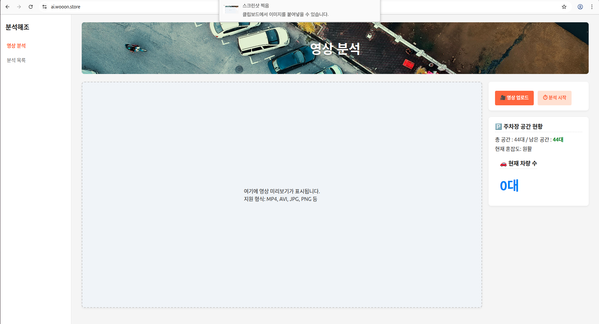
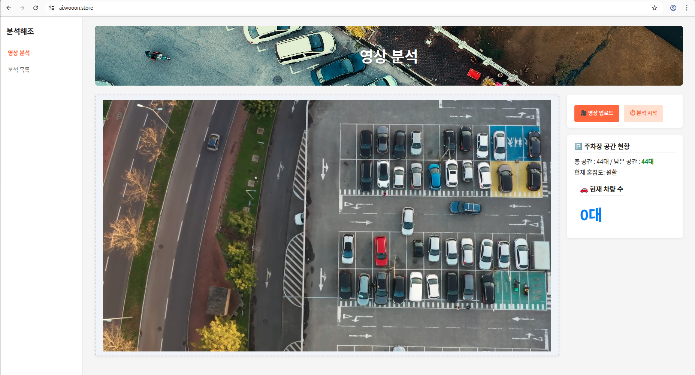
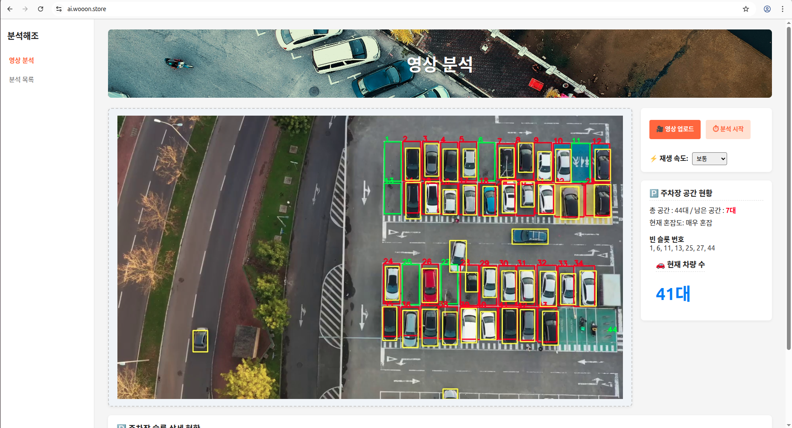

# 🅰️ AI 분석 프로젝트 (대형 주차장 슬롯 체크)

대형 주차장의 지정한 주차 슬롯과 AI로 분석한 차량 인식을 이용하여 
**주차 점유율 확인**, **차량 대수 측정**, **혼잡도 안내** 등을 지원하는 프로젝트입니다.

---

### 🌐 서비스 URL
<a href="https://ai.wooon.store" target="_blank" rel="noopener noreferrer">
  https://ai.wooon.store
</a>

---

## 1️⃣ 프로젝트 소개

- **🗓 프로젝트 기간** : 2025.11 ~ 2025.12  
- **👨‍👩‍👧‍👦 팀원** : 김민종, 권미선, 허성운

---

## 2️⃣ 기획 배경

- 바닥 센서를 활용한 스마트 주차장의 한계 ([참고 영상](https://www.youtube.com/watch?v=5lbrM_tGkRU))  
- 주차 슬롯마다 센서를 설치해야 하는 경제적 부담  
- 실시간(분 단위)으로 **주차 대수와 슬롯 점유, 혼잡도 안내 가능성**  
- 대형 주차장(해외 야구장, 마트 등)에 적용 가능

---

## 3️⃣ 서비스 소개 💡

- 탑 뷰 주차 영상 업로드 후 **차량 인식(YOLO 학습)**  
- 주차 슬롯은 `슬롯 지정.csv` 파일로 생성  
- AI 분석 결과 차량 박스 중심점이 슬롯 안에 들어가면 **점유로 인식**  
- **인식 결과 제공**
  - 총 차량 대수
  - 총 슬롯 수
  - 점유 수
  - 혼잡도
  - 슬롯 시각화

---

## 4️⃣ 서비스 대상 👥

- 대형 마트 야외 주차장  
- 해외 야구장 주차장 등 대형 주차장  
- 주차 센서 도입이 어려운 주차장

---

## 5️⃣ 주요 서비스 기능 화면 🖥

### 1) 메인 페이지

  

### 2) 영상 업로드
- 영상 업로드

  

### 3) 분석 페이지
- 분석 시작 버튼
- 초록박스 : 빈 슬롯 / 노란박스 : 차량 인식 / 빨간박스 : 점유 슬롯
- 총 공간, 남은 공간, 혼잡도, 빈 슬롯, 차량 수 파악

  

### 4) 점유 슬롯 시각화
- 빈 슬롯, 점유 슬롯 색상 (초록, 빨강) 시각화

  

---

## 6️⃣ 기술 스택 🛠

### 🔹 Front-end
- React  
- JavaScript  

### 🔹 Back-end
- Python  

### 🔹 AI
- YOLO  
- Miniconda

---

## 7️⃣ 마무리 📌

- 본 프로젝트는 대형 주차장(야외)의 차량 ai 인식을 통한 슬롯 점유 파악 시스템으로, 추후에 영상 업로드가 아닌 실시간 영상 전송, 사용자에게 정보 전달 등의 확장을 염두에 두고 설계를 진행하였습니다.
